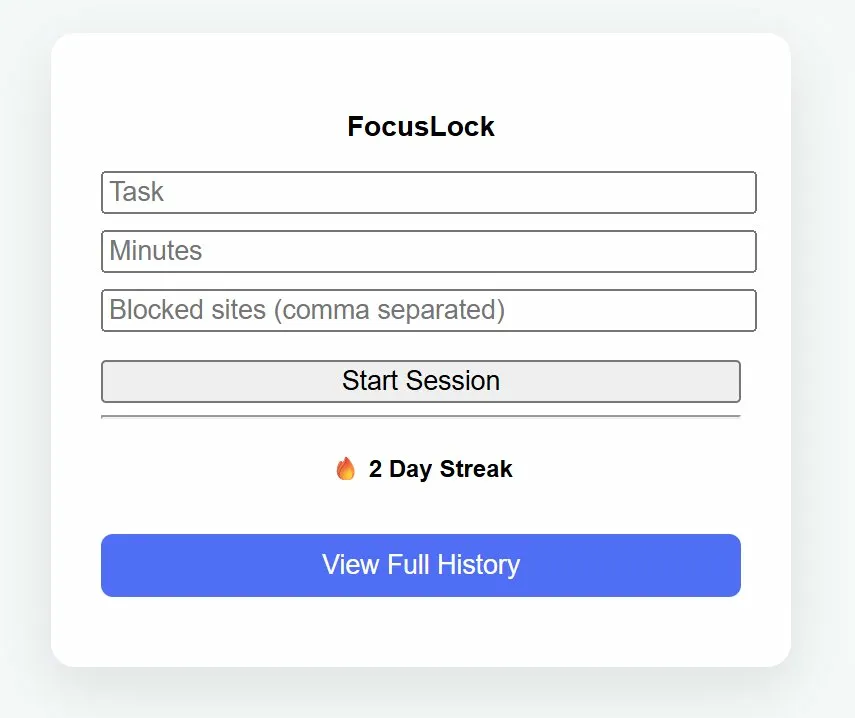
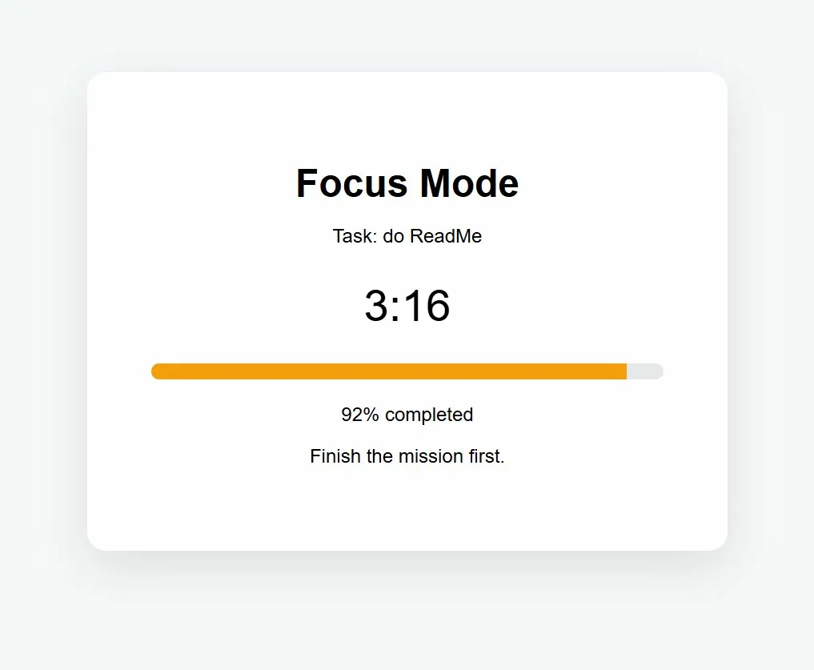
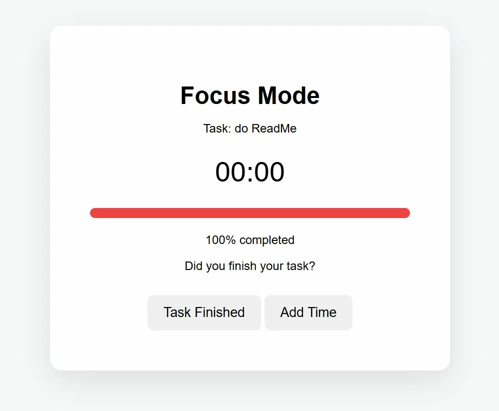
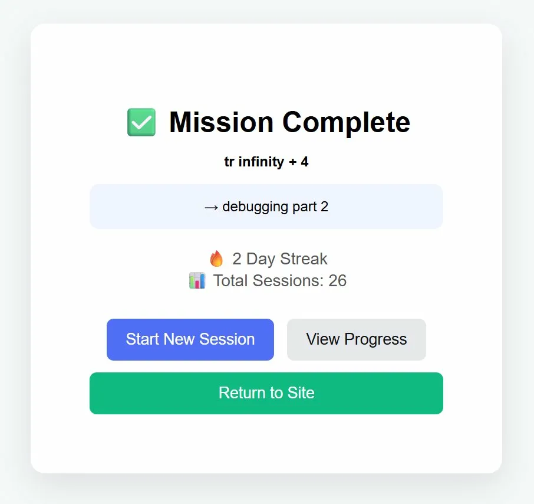
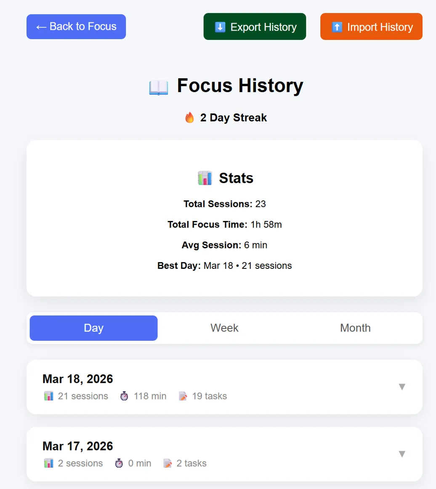

# FocusLock
A Chrome extension for distraction-free focus sessions, streak tracking, and accountability-driven productivity. 

## Screenshots
<table>
  <tr>
    <td></td>
    <td></td>
  </tr>
  <tr>
    <td align="center">Popup</td>
    <td align="center">Focus Mode</td>
  </tr>
  <tr>
    <td></td>
    <td></td>
  </tr>
  <tr>
    <td align="center">Session Complete</td>
    <td align="center">Mission Complete</td>
  </tr>
</table>

## What It Does
FocusLock helps users stay focused and build consistent work habits through structured sessions, progress tracking, and reflection. Unlike passive timers, FocusLock requires you to define a specifc task before starting a session, encouraging clarity and goal-oriented work. 

## Features
- <b>Intentional Task Setting (Pre-Commitment)</b>
    Users must define a specific task before starting a focus session
- <b>Website Blocking</b>
    Blocks distracting sites while a session is active
- <b>Custom Focus Timer</b>
    Start timed sessions with a live progress bar and countdown
- <b>Session Reflection (Post-Session Logging)</b>
    Users are required to write what they accomplished before completing a session, reinforcing accountability.
- <b>Stats Dashboard</b>
    View total sessions, total focus time, average session length and best day
- <b>Streak Tracking</b>
    Track consecutive days of productivity
- <b>Session History</b>
    View past sessions grouped dynamically by day, week or month
- <b>Import/Export Data</b>
    Backup and restore session history locally

## Motivation
As a student balancing intensive academic work and personal projects, I often struggled with staying focused despite using traditional productivity tools. Many tools either focused solely on blocking distractions or tracking time, but didn't address the full workflow of intentional work. 

I built FocusLock to solve this problem by creating a system that encourages:
- Setting a clear task before starting
- Eliminating distractions during work
- Reflecting on what was accomplished afterward

By combining these elements, FocusLock transforms productivity from simply "spending time" into actively making progress. This project reflects my interest in building tools that are not only functional, but also aligned with how people actually work and stay accountable. 

## Installation
Since this extension is not on the Chrome Web Store, you can load it manually.
  1. Clone or download this repository
  2. Open Chrome and go to `chrome://extensions`
  3. Enable **Developer mode** (top right toggle)
  4. Click **Load unpacked**
  5. Select the project folder
 
## Usage
  1. Click the FocusLock icon in your Chrome toolbar
  2. Enter:
     - Your task
     - Distracting websites to block
     - Focus duration (in minutes)
  3. Click **Start Session** to begin and distracting sites will be blocked
  4. Work until the timer ends while Focus Mode is active
  5. When the timer ends:
     - Choose **Add Time** if needed
     - Or select **Task Finished** if completed
  6. Write a brief reflection on what you accomplished (required)
  7. Click **Save** to log the session
  8. View your progress, stats, and streaks in the **History** page

## Tech Stack
- JavaScript (Vanilla)
- Chrome Extensions API
- HTML/CSS
- Local Storage (chrome.storage.local)

---
✨ Built as a portfolio project focused on intentional work, accountability, and real-world usability
